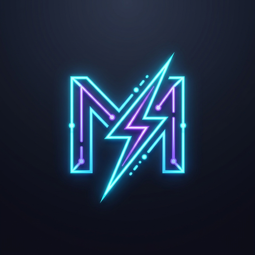

<div align="center">
  
  <h1>Mels</h1>
  <p>A fast, private, local-first API client built for complete data ownership.</p>
</div>

---

## Overview

Mels is a modern, lightweight, and high-performance desktop API client built with Go, Wails v2, React, and TypeScript. It is designed around complete data ownership, local-first storage, and privacy—keeping all your API requests, collections, environment variables, sensitive tokens, and history stored strictly on your local machine without accounts, cloud lock-in, analytics, or telemetry.

---

## Features

- **Native Desktop Performance**: Powered by Go's native OS socket networking with connection pooling, keep-alive reuse, and zero CORS restrictions.
- **Clean and Minimal Interface**: Built with Material UI (MUI v6) and Lucide icons, offering a focused dark obsidian workspace.
- **VS Code Monaco Editor**: Integrated Monaco Editor providing syntax highlighting, formatting, and code folding for JSON, XML, HTML, and JavaScript.
- **Collection Management**: Organize requests into collections and folders with instant creation, inline renaming, and zero alert dialogs.
- **Detailed Network Timing**: Sub-millisecond timing breakdown including DNS Lookup, TCP Connect, TLS Handshake, Server TTFB, and Content Download.
- **JavaScript Scripting and Test Assertions**: Integrated JavaScript sandbox for pre-request scripts and post-response assertions (`mels.test()`, `mels.expect()`).
- **Dynamic Environment Variables**: Interpolate environment variables across URLs, headers, query parameters, and request bodies using `{{variable}}` syntax.
- **Persistent Storage**: Local-first storage saved directly to disk (`~/.mels/storage/`) with single-click data management and clearing.
- **Native Import and Export**: Direct collection import and export through native operating system file pickers.
- **Native Windows Frame**: Clean native Windows title bar and system window controls.

---

## Tech Stack

- **Backend**: Go (Native `net/http` transport pooling, `httptrace`, local disk storage)
- **Desktop Framework**: Wails v2
- **Frontend**: React 18, TypeScript, Vite
- **UI Components**: MUI v6, Lucide React
- **Code Editor**: Monaco Editor (`@monaco-editor/react`)

---

## Getting Started

### Prerequisites

- Go (1.20 or newer)
- Node.js (v18 or newer) and npm
- Wails CLI (`go install github.com/wailsapp/wails/v2/cmd/wails@latest`)

### Development Mode

Clone the repository and run live development with hot-reloading:

```bash
git clone https://github.com/username/mels.git
cd mels
wails dev
```

### Production Build

To compile a self-contained, optimized native Windows executable:

```bash
wails build
```

The output binary will be created in `build/bin/mels.exe`.

---

## Testing

Run the backend test suite covering HTTP execution, authentication, scripting, and concurrency:

```bash
go test -v ./...
```

---

## License

This project is open-source software licensed under the [MIT License](LICENSE).
